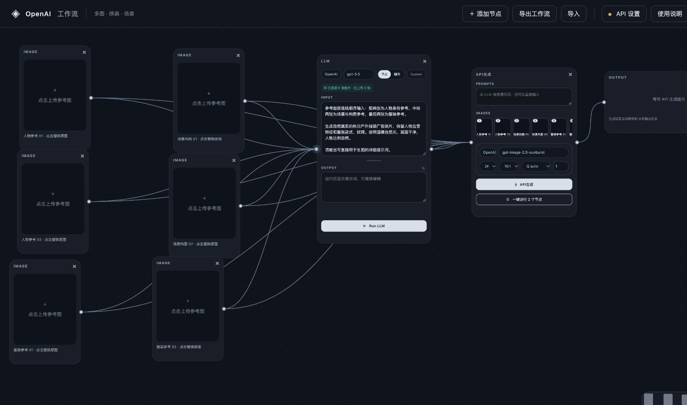
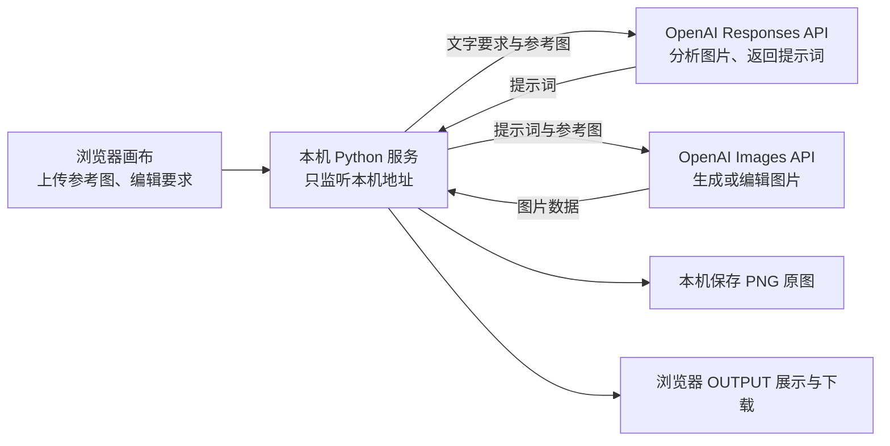

# OpenAI Canvas · 多图工作流便携版

一个在自己电脑上运行的可视化图片工作流工具。把人物、服装、场景等参考图连接起来，先让 OpenAI 的语言模型分析图片并整理提示词，再调用图片模型生成结果。

**适合：多图参考创作、服装换装概念图、人物与场景组合、商品氛围图，以及提示词优化。** 不需要安装 ComfyUI、Python、显卡驱动或下载模型；生成计算由 OpenAI 云端 API 完成。



> 本项目不是 OpenAI 官方产品。需要自己的 OpenAI API Key、可用额度及能访问 OpenAI API 的网络。API 按用量计费，不使用 ChatGPT 网页订阅额度。

## 提示词示例

[截图 INPUT 提取与双人物换装示例](prompts/screenshot-input.md)包含截图转录、辨读说明和可直接复制的六图整理版；也可下载[整理版纯文本](prompts/two-person-outfit.txt)。使用前请核对参考图编号。

## 主要功能

| 功能 | 可以做什么 |
| --- | --- |
| 多图参考 | 上传人物、服装、场景等图片，按连线选择哪些图片参与分析或生图 |
| LLM 提示词处理 | 分析参考图，根据你的要求生成更完整的生图提示词；输出可手动修改 |
| 图片生成与参考图编辑 | 根据文字生成图片，或结合多张参考图生成新画面 |
| 可视化工作流 | 拖动节点、连接/删除连线、缩放和平移画布，按需添加节点 |
| 单步或一键执行 | 只运行 LLM、只运行生图，或一键先分析再生成 |
| 参数调整 | 编辑模型名称，选择尺寸、画幅、质量及生成数量 |
| 保存与下载 | 本机自动保存画布和参考图，导入/导出工作流，查看及下载生成原图 |
| 生成历史 | 自动保存成功生成的图片、提示词、模型参数和参考图；一键复用为新节点 |
| 参考图角色 | 为图片选择人物、服装、场景、动作构图、商品或风格，并随图号传给模型 |
| 并发保护 | 同一后台服务一次只执行一个 API 任务，避免多个窗口同时重复运行 |

人物、衣服细节和布局的一致性由生成模型决定，不保证像素级复刻，也不是精确的服装尺寸模拟或传统图层编辑软件。

## 1. 下载对应系统的便携包

打开 **[Releases 下载页面](https://github.com/bullshitAI52/openai-canvas-portable/releases/latest)**，选择与你的电脑匹配的文件：

| 电脑 | 下载 | ZIP 大小 | 双击启动文件 |
| --- | --- | --- | --- |
| Windows 10/11，Intel 或 AMD 64 位 | [Windows x64](https://github.com/bullshitAI52/openai-canvas-portable/releases/download/v1.2.0/OpenAI-Canvas-Windows-x64.zip) | 18.4 MB | `Start-Windows.bat` |
| Mac，M1/M2/M3/M4 等苹果芯片 | [Mac Apple Silicon](https://github.com/bullshitAI52/openai-canvas-portable/releases/download/v1.2.0/OpenAI-Canvas-macOS-AppleSilicon.zip) | 30.9 MB | `Start-macOS.command` |
| Mac，Intel 处理器 | [Mac Intel](https://github.com/bullshitAI52/openai-canvas-portable/releases/download/v1.2.0/OpenAI-Canvas-macOS-Intel.zip) | 31.3 MB | `Start-macOS.command` |

Mac 可在苹果菜单 →「关于本机」查看芯片类型。Mac 包以 macOS 11 及以上为目标；Windows ARM 设备没有原生包，未进行兼容性验证。

**下载上表的 ZIP，不要下载 GitHub 自动提供的 `Source code`。** 后者是源码，不含便携运行环境。

## 2. 解压和启动

1. 将整个 ZIP 解压到一个你可以正常读写的文件夹。
2. 双击对应的 `Start` 启动文件，浏览器会自动打开工作流页面。
3. 保持启动时出现的终端/命令窗口打开，它是本机后台服务。

不要在压缩包内部直接运行，也不要只复制启动文件。需要保留同一文件夹中的 `app` 和 `runtime`。

默认地址是 **`http://127.0.0.1:8189/openai-canvas`**。如果端口被其他程序占用，会选择后续端口，并打开实际地址。重复启动会打开已有的独立版服务。

这个地址只指向你自己的电脑，不是公网网站。**无需打开 ComfyUI 桌面端，也无需导入 ComfyUI 工作流。**

退出时点击网页右上角「退出服务」，会保存工作流并停止后台；生成过程中请等待任务完成。仅关闭网页不会停止后台，关闭启动窗口则会停止服务。

## 3. 设置 API Key

1. 点击右上角「API 设置」。
2. 填入你自己的 OpenAI API Key，然后保存。
3. 确认你的 OpenAI 项目有相应模型的使用权限及可用额度。

密钥保存在当前操作系统用户的数据目录，不会写入导出的工作流。设置指示灯表示本机已配置密钥，**不代表已经验证密钥有效、账户额度或模型权限**。程序目前只连接官方 `api.openai.com`。

模型字段可以直接编辑。默认文字模型是 `gpt-5.5`，图片模型是 `gpt-image-2.5-sunburst`；实际是否可用取决于你的账户。更换图片模型后，应选择该模型支持的尺寸和参数。

## 4. 第一次运行：多图换装与场景示例

默认画布包含六个图片节点，已连接到 LLM 和 API生成节点：

| 参考顺序 | 建议放入的内容 |
| --- | --- |
| 1、2 | 人物身份、面部特征参考 |
| 3、4 | 场景、光线、构图参考 |
| 5、6 | 服装款式、颜色、纹理参考 |

这只是预设用途，图片角色最终由你的提示词说明决定。可以换成其他数量的图片，也可以添加新的图片节点。

### 上传图片

点击 IMAGE 节点里的上传区域，选择 PNG、JPEG 或 WebP 原图。当前单张上传上限为 20 MB。

**已经连接的图片节点必须上传图片。** 不需要的参考图，请删除节点或对应连线；空节点不会自动忽略。

### 写下你的要求

在 LLM 节点的 INPUT 中明确说明每张图的用途。例如：

```text
图1是主要人物身份参考，请保留她的五官与发型。
图2只参考人物的自然站姿，不采用图2的人脸。
图3和图4参考秋日庭院场景、木屋背景与温暖自然光。
图5参考米色针织开衫，图6只参考针织纹理。

请设计一张横版服装广告照片：人物穿米色开衫和牛仔裤，
站在木屋旁，画面自然真实，服装材质清晰，背景不过度虚化。
输出可直接用于图片生成的详细提示词，不要解释过程。
```

参考图编号遵循**连接到该节点的连线顺序**。如果重新连线，应检查 API生成节点里的缩略图编号，并同步调整提示词。LLM 与生图节点可连接不同的参考图；使用编号描述时建议保持两边顺序一致。

### 执行方式 A：一键运行

在 API生成节点点击「一键运行 2 个节点」：

1. LLM 分析连接到自己的图片和 INPUT。
2. LLM 返回的文字自动填入 API生成节点的 PROMPTS。
3. 图片模型结合 PROMPTS 和连接到 API生成节点的图片生成结果。
4. 结果显示在 OUTPUT，并保存到本机。

### 执行方式 B：分两步控制结果

1. 点击 LLM 节点的 **Run LLM**。
2. 阅读、修改 LLM 的 OUTPUT，或直接修改 API生成节点的 PROMPTS。
3. 选择尺寸、画幅、质量和数量。
4. 点击 **API生成**。

只想用自己的提示词时，可以直接填写 PROMPTS，然后点击 API生成，不必调用 LLM。不连接任何参考图到 API生成节点时，会走纯文字生图。

**单独点 API生成会使用当前 PROMPTS，不会重新执行上游 LLM。** 修改 INPUT 或参考图后，需要重新 Run LLM，或自行同步修改 PROMPTS。

## 5. 各节点和操作说明

| 节点/操作 | 含义 |
| --- | --- |
| IMAGE | 上传一张参考图；右侧端口可以连接多个节点 |
| LLM / INPUT | 输入要求；结合连接的图片生成文字 |
| LLM / System | 编辑语言模型的系统提示词，控制输出要求和风格 |
| LLM / 节点模式 | 使用 System 和 INPUT 生成提示词 |
| LLM / 聊天模式 | 根据图片回答 INPUT 中的问题；每次调用独立，不保留多轮聊天历史 |
| LLM / OUTPUT | 模型输出，可编辑、复制，并传入下游生图节点 |
| API生成 / PROMPTS | 实际发送给图片模型的文字提示词 |
| API生成 / IMAGES | 实际发送给图片模型的参考图与顺序 |
| OUTPUT | 查看生成结果，点击图片放大或下载原图 |

画布操作：

- 拖动节点标题移动节点；拖动空白处平移；滚轮缩放。
- 先点击源节点右侧端口，再点击目标左侧端口建立连线。
- 点击连线删除；点击节点的 × 删除节点；Esc 取消正在建立的连线。
- 「添加节点」可增加 IMAGE、LLM、API生成、OUTPUT。
- 「适应画布」显示整个工作流。
- 支持 IMAGE → LLM / API生成、LLM → API生成、API生成 → OUTPUT。
- 一个 API生成节点只接收一个 LLM 的文字输出。

## 工作原理：什么在本机，什么在云端？



- **浏览器前端**负责画布、节点、连线、上传和结果显示，不在浏览器中直接请求 OpenAI。
- **本机后台**读取保存在本机的密钥，转换参考图方向与格式，再发起 HTTPS API 请求。
- **语言分析**使用 Responses API，把 INPUT、System 和连接的参考图送给语言模型，取回文字提示词。
- **图片处理**在有参考图时使用 Images Edits 接口；没有参考图时使用 Images Generations 接口。
- **生成计算**由 OpenAI 云端模型执行。本机只处理文件、图片格式与界面，所以无需下载大模型或配置 GPU。
- **便携包**包含程序、Python 运行环境、Pillow 图像处理库和 certifi 证书，不包含 ComfyUI 或本地推理模型。

参考官方接口说明：[图像理解](https://developers.openai.com/api/docs/guides/images-vision) · [图片生成与编辑](https://developers.openai.com/api/docs/guides/image-generation)。

## 保存位置、隐私与分享

画布和参考图会自动保存为本机文件。页面底部出现「已保存到本机」后，表示最新修改保存完成。请避免在多个窗口同时编辑同一画布，最后保存的窗口会覆盖前面的状态。

| 内容 | 保存方式 |
| --- | --- |
| API Key | 本机 `config.local.json`，不是导出工作流的一部分；文件未做额外加密 |
| 画布和已上传参考图 | 本机 `workflow.json` |
| 生成原图 | 数据目录下的 `outputs` 文件夹 |
| 导出的工作流 | 你下载的 JSON，包含参考图，不含密钥 |

本机数据目录：

- Windows：`%LOCALAPPDATA%\OpenAI Canvas`
- Mac：`~/Library/Application Support/OpenAI Canvas`

点击页面「使用说明」也可看到实际图片保存位置。移动软件文件夹不会移动这些数据。

执行 LLM 或生图时，对应提示词及已连接图片会发送到 OpenAI。未执行时，上传与编辑发生在本机。不要将密钥配置文件或不想分享的参考图提交到 GitHub。

**分享软件请发送原始 Release ZIP。** 每位使用者填写自己的密钥。分享工作流时注意：JSON 包含参考图，但生成结果只保存本机文件引用，结果原图需要另外发送。

## 常见问题

| 问题 | 处理方法 |
| --- | --- |
| 页面打不开 | 确认启动窗口仍在运行，按启动窗口显示的实际地址打开 |
| 提示参考图未上传 | 为所有已连接的图片节点上传原图，或删除不需要的节点/连线 |
| API Key 错误或没有权限 | 检查密钥、项目权限、模型名称；本地设置成功不代表远端验证成功 |
| 额度不足或请求过多 | 检查 OpenAI 项目额度及接口限额，稍后再运行 |
| 模型不存在 | 将模型字段改为自己账户有权限使用的模型 |
| 尺寸/质量参数不支持 | 选择目标模型支持的参数；部分旧图片模型只支持固定尺寸 |
| 请求超时或网络不可达 | 检查到官方 OpenAI API 的连接。不要连续重复运行；远端请求可能已执行并计费 |
| 导入后结果图片打不开 | 结果文件不包含在工作流 JSON 中，需另行取得对应原图 |
| 导入 ComfyUI JSON 失败 | 独立画布格式与 ComfyUI 原生格式不同，目前只支持画布导出的 JSON |
| 退出时提示还有任务 | 等待生成完成再退出，避免中断保存 |
| 系统提示未知发布者/来源 | 包没有发布者签名或 Apple 公证；不要关闭系统安全保护，受组织策略限制时请管理员审核 |

程序不会自动重试付费请求。遇到超时，先检查本机输出目录和 OpenAI 用量，再决定是否重试。

## 验证范围与已知限制

- 14 项后端测试、9 项画布逻辑回归场景通过，测试不会调用付费 API。
- Mac Apple Silicon 实测；Mac Intel 包通过 Rosetta 及解压后独立启动检查，未在 Intel 实机验证。
- **Windows 已检查文件结构、原生依赖架构和完整性，尚未 Windows 实机运行测试。**
- 没有使用真实 API Key 完成付费生图；账户模型权限、实际网络和最终生成质量仍需首次运行确认。
- 便携包未做 Windows 发布者签名或 Apple 开发者公证。

详细记录：[使用说明](使用说明.md) · [检查结果](检查结果.md)。

## 开发者：从源码运行

源码需要 Python 3.13；普通使用者直接下载便携 ZIP 即可。

```sh
python -m venv .venv
# macOS / Linux
source .venv/bin/activate
# Windows PowerShell 使用：.venv\Scripts\Activate.ps1
python -m pip install -r requirements.txt
python server.py
```

- 不自动打开浏览器：`python server.py --no-browser`
- 指定起始端口：`python server.py --port 8189`
- `OPENAI_API_KEY`：提供密钥，优先于本机配置。
- `OPENAI_CANVAS_DATA_DIR`：指定用户数据目录。

测试：

```sh
python tests/test_server.py
node tests/test_ui.cjs
```

源码结构：

```text
server.py         本机 HTTP 服务、配置、保存、并发保护
engine.py         OpenAI API 请求与图片转换
studio/           画布 HTML、CSS、JavaScript
tests/            后端与画布回归测试
docs/preview.png  界面截图
```

便携包附带运行环境来源、哈希及第三方许可证；Release 中的 `SHA256SUMS.txt` 可用于校验下载完整性。

## v1.1.0：生成历史与参考图标签

- 点击顶部「生成历史」查看新版本中成功生成的结果、提示词及参数。点击缩略图可打开原图。
- 点击「复用为新的一组节点」会恢复参考图、角色标签、生图提示词和参数，并新增 API生成、OUTPUT 节点。原画布保留；不会自动调用 API，点击「API生成」后才执行。
- 每个 IMAGE 图片下方可选择角色。角色会自动保存、随工作流导出，并按实际连线顺序加入发送给模型的提示词。旧工作流没有标签时显示「未指定」，不会推测角色；标签不改变图号，请确保文字要求与标签一致。
- 历史保存在用户数据目录的 `history/`，原图仍在 `outputs/`。历史包含参考图副本，不包含 API Key；会随使用占用磁盘空间。仅导出工作流不会打包全部历史。
- v1.0.0 的旧结果不会自动补建历史，因为当时未保存完整生成参数。
- 升级：先退出旧版服务，解压新版便携包后启动。使用同一系统账户和默认数据目录时，会继续读取已有密钥、工作流和输出文件。

本次使用模拟 API 验证 17 项后端测试及前端回归，并检查浏览器中的标签和历史复用。未进行真实付费生图；Windows 仍未进行实机测试。

## v1.2.0：提示词模板与运行提示

- 顶部「提示词模板」提供单人换装、双人海报、商品展示、场景融合四种模板。
- 选择目标 LLM INPUT 或 API生成 PROMPTS，预览并编辑内容，再点击「替换目标提示词」或「追加到目标提示词」。仅填入文字，不自动执行；替换会覆盖目标原有提示词，追加保留原内容。
- 模板中的图号占位符需要按实际连线填写；直接用于生图时请去掉要求语言模型输出提示词的语句。
- 运行时显示当前步骤和实时耗时。一键执行区分分析提示词和图片生成两步；耗时不代表进度百分比。
- 失败时在对应节点保留错误详情与处理建议，覆盖密钥、额度、限流、模型权限、网络和内容限制等情况。不会自动重试付费请求。
- 网络中断、超时或服务异常时，先查看历史与输出目录，确认是否已有结果再决定重试。

验证：原有 17 项后端测试通过；新增模板与错误建议测试、两步执行状态及失败后停止后续调用的测试通过。未调用真实付费 API。
